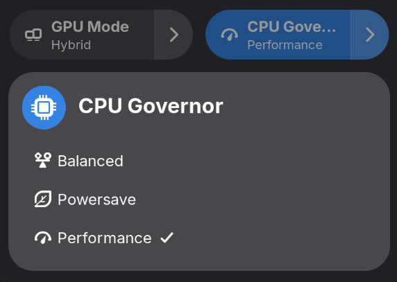

# Auto-cpufreq Switcher

>[!CAUTION]
> This is a work in progress, mostly done with vibe coding. Use at your own risks!

Auto-cpufreq governor switcher for Gnome

Currently tested on Arch / Gnome 8 / Wayland
Supergfxctl v2.5.0

Only supports default modes :
- Balanced
- Powersaver
- Performance



## Installation

- Install [auto-cpufreq](https://github.com/AdnanHodzic/auto-cpufreq)
- Clone this repo `git clone https://github.com/EBendinelli/auto-cpufreq-switcher.git`
- Copy 
    ```bash
    cp -rf auto-cpufreq-switcher ~/.local/share/gnome-shell/extensions/auto-cpufreq-switcher@ebdendinelli.github.io
    ```
- Enable extension: `gnome-extensions enable auto-cpufreq-switcher@ebdendinelli.github.io`
